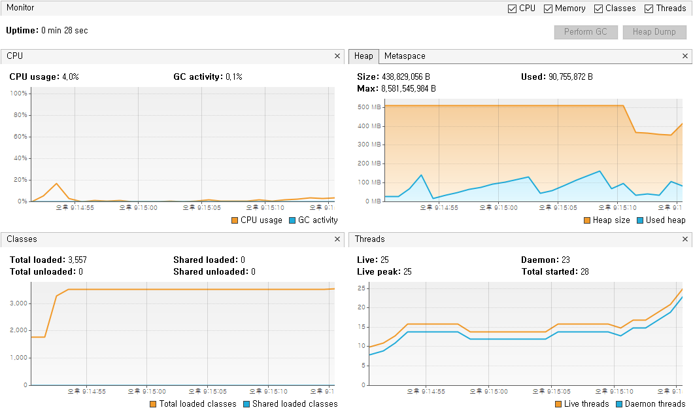

# `ResultSet`의 `fetchSize` 변경

## 스펙

- window 10 Pro, 32G, i7
- docker mysql (8.0.15)

## 준비

- 10만 row 입력 후, 전체 row를 select 
- fetch size 미변경 & 변경
- 소요 시간 측정 & 메모리 사용량 측정
- `useCursorFetch=true` 옵션 추가 / mairadb는 해당 옵션이 없음

## 소요 시간

### fetch 미변경

320 ~ 400 ms

### fetch 변경

| fetch size | time(ms) |
|------------|----------|
| Integer.MIN_VALUE | 682 |
| 5 | 12367 |
| 10 | 6401 |
| 50 | 1632 |
| 100 | 1115 |
| 500 | 606 |
| 1000 | 527 |
| 2500 | 508 |
| 5000 | 464 |

## 메모리 사용량

### fetch 미변경

### fetch 변경 (Integer.MIN_VALUE, 5, 10, ... , 5000)

## 패킷 분석

### fetch 미변경

### fetch 변경 (5)

- `net_buffer_length` Default 16384 bytes
- `max_allowed_packet` Default 16777216 bytes (16M)

## 참고

- https://mariadb.com/kb/en/library/about-mariadb-connector-j/#streaming-result-sets
- https://dev.mysql.com/doc/connector-j/8.0/en/connector-j-reference-implementation-notes.html